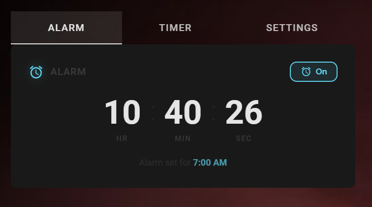

# Alarm Countdown Card

A sleek countdown-to-alarm card for [Home Assistant](https://www.home-assistant.io/) Lovelace dashboards. Live countdown, one-tap enable/disable, and a big honking dismiss button when the siren goes off.


<!-- Drop a screenshot or GIF here. People decide in 2 seconds whether to install. -->


## Features

- ⏱️ Live HH:MM:SS countdown to your next alarm
- 🔘 Inline toggle to arm/disarm the alarm without leaving the dashboard
- 🚨 Pulsing red **Dismiss** button that appears only when the siren is firing
- 🌗 Adapts to your Home Assistant theme via CSS variables
- 🪶 Zero dependencies — vanilla web component, ~10 KB

## Installation

### HACS (recommended)

1. In HACS → **⋮** menu → **Custom repositories**
2. Add `https://github.com/YOUR_USERNAME/alarm-countdown-card` with category **Dashboard**
3. Install **Alarm Countdown Card**
4. Hard-refresh your browser (Ctrl/Cmd + Shift + R)

### Manual

1. Copy `alarm-countdown-card.js` to `/config/www/`
2. Add the resource in **Settings → Dashboards → ⋮ → Resources**:
   - URL: `/local/alarm-countdown-card.js`
   - Type: **JavaScript module**
3. Hard-refresh your browser

## Required helpers

Create these in **Settings → Devices & services → Helpers** before adding the card:

| Helper | Type | Purpose |
| --- | --- | --- |
| `input_datetime.alarm_time` | Date/time (time only) | When the alarm should fire |
| `input_boolean.alarm_active` | Toggle | Master arm/disarm switch |
| `siren.alarm` | Siren entity | Whatever device actually wakes you up |

You can use any entity IDs you like — just point the card config at them.

## Configuration

Add the card to your dashboard via **Edit dashboard → Add card → Custom: Alarm Countdown**, or paste YAML:

```yaml
type: custom:alarm-countdown-card
entity: input_datetime.alarm_time
toggle_entity: input_boolean.alarm_active
siren_entity: siren.alarm
name: Bedroom Alarm
icon: mdi:alarm
show_seconds: true
```

### Options

| Option | Type | Default | Description |
| --- | --- | --- | --- |
| `entity` | string | `input_datetime.alarm_time` | The `input_datetime` holding the alarm time |
| `toggle_entity` | string | `input_boolean.alarm_active` | The `input_boolean` that arms/disarms the alarm |
| `siren_entity` | string | `siren.alarm` | The siren entity the **Dismiss** button will turn off |
| `name` | string | `Alarm` | Title shown in the card header |
| `icon` | string | `mdi:alarm` | Material Design Icon for the header |
| `show_seconds` | boolean | `true` | Show the seconds column in the countdown |

## How it pairs with an automation

This card is the UI half. The brains live in a Home Assistant automation that watches `input_datetime.alarm_time` and turns on `siren.alarm` when the time matches and `input_boolean.alarm_active` is on. A consolidated `repeat/while` loop with `wait_for_trigger` listening for the dismiss boolean works really well — see the [HA automation docs](https://www.home-assistant.io/docs/automation/) for patterns.

## Theming

The card respects your active HA theme via standard variables:

- `--ha-card-background`
- `--ha-card-border-radius`
- `--primary-text-color`
- `--secondary-text-color`
- `--accent-color`

Override any of them in your theme YAML to restyle without forking the card.

## Troubleshooting

**"Custom element doesn't exist"** — The resource isn't loaded. Verify the resource entry and hard-refresh.

**Toggle button shows the entity ID in orange** — The `toggle_entity` doesn't exist. Create the helper or fix the entity ID in your card config.

**Countdown shows `--`** — The `entity` is missing or its value can't be parsed as a time.

## Contributing

Issues and PRs welcome. Please include your HA version, the card version, and a screenshot if it's a visual bug.

## License

[MIT](LICENSE) — do whatever, just don't blame me if you oversleep.
